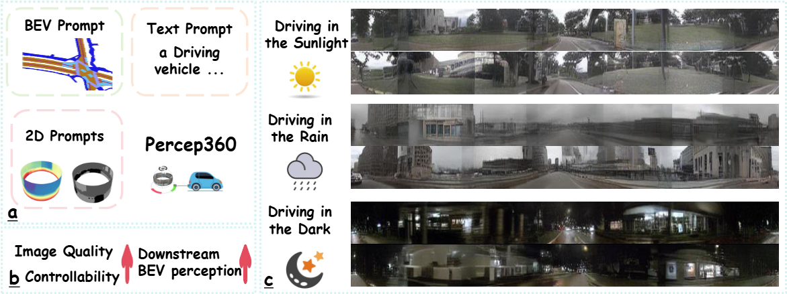

<div align="center">
<p align="center">Hallucinating 360°: Panoramic Street-View Generation via Local Scenes Diffusion and Probabilistic Prompting

<p align="center"> ###
<br>

<div align="center">
  Fei&nbsp;Teng</a> 
  <b>&middot;</b>
  <a href="https://www.researchgate.net/profile/Jiaming-Zhang-10" target="_blank">Jiaming&nbsp;Zhang</a> 
  <b>&middot;</b>
  <a href="https://www.researchgate.net/profile/Kunyu-Peng" target="_blank">Kunyu&nbsp;Peng</a> 
  <b>&middot;</b>
  <a href="https://www.researchgate.net/profile/Kailun-Yang" target="_blank">Kailun&nbsp;Yang</a> 

 <br>

  <a href="https://arxiv.org/abs/2507.06971" target="_blank">Paper</a>

# 

</div>

<p align="center">:hammer_and_wrench: :construction_worker: :rocket:</p>
<p align="center">:fire: This repository is the repository of Percep360. :fire:</p>

</div>

<div align=center></div>

### Update
- 2025.07.21 Codestuff is on processing.
- 2025.07.21 Init repository.
- 2025.07.21 Release the [arXiv](https://arxiv.org/abs/2507.06971) version.


### TODO List

- [ ] Release the arXiv version.
- [ ] The code for OAFuser has been released.
- [ ] The integration of Code will be released.
- [ ] Train and Eval strategy will be released.
- [ ] Checkpoints will be released.

### Abstract

Panoramic perception holds significant potential for autonomous driving, enabling vehicles to acquire a comprehensive 360° surround view in a single shot. However, autonomous driving is a data-driven task. Complete panoramic data acquisition requires complex sampling systems and annotation pipelines, which are time-consuming and labor-intensive. Although existing street view generation models have demonstrated strong data regeneration capabilities, they can only learn from the fixed data distribution of existing datasets and cannot achieve high-quality, controllable panoramic generation. In this paper, we propose the first panoramic generation method Percep360 for autonomous driving. Percep360 enables coherent generation of panoramic data with control signals based on the stitched panoramic data. Percep360 focuses on two key aspects: coherence and controllability. Specifically, to overcome the inherent information loss caused by the pinhole sampling process, we propose the Local Scenes Diffusion Method (LSDM). LSDM reformulates the panorama generation as a spatially continuous diffusion process, bridging the gaps between different data distributions. Additionally, to achieve the controllable generation of panoramic images, we propose a Probabilistic Prompting Method (PPM). PPM dynamically selects the most relevant control cues, enabling controllable panoramic image generation. We evaluate the effectiveness of the generated images from three perspectives: image quality assessment (i.e., no-reference and with reference), controllability, and their utility in real-world Bird's Eye View (BEV) segmentation. Notably, the generated data consistently outperforms the original stitched images in no-reference quality metrics and enhances downstream perception models. 

### Method

Todo.

### 🤝 Publication:
Please consider referencing this paper if you use the ```code``` or ```data``` from our work.
Thanks a lot :)

```
@article{teng2025hallucinating,
  title={Hallucinating 360 $\{$$\backslash$deg$\}$: Panoramic Street-View Generation via Local Scenes Diffusion and Probabilistic Prompting},
  author={Teng, Fei and Luo, Kai and Wu, Sheng and Li, Siyu and Guo, Pujun and Wei, Jiale and Peng, Kunyu and Zhang, Jiaming and Yang, Kailun},
  journal={arXiv preprint arXiv:2507.06971},
  year={2025}
}
```
